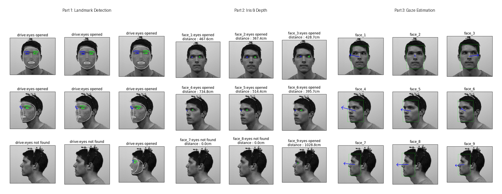

# Face Landmark & Gaze Estimation

Face and eye analysis pipeline using MediaPipe and L2CS-Net, covering landmark detection, iris depth estimation, ellipse fitting, and gaze direction prediction.

## Overview

| Notebook | Topic | Method |
|----------|-------|--------|
| [`part1_face_landmark_detection.ipynb`](part1_face_landmark_detection.ipynb) | Face & Eye Landmark Detection | MediaPipe Face Landmarker |
| [`part2_iris_analysis.ipynb`](part2_iris_analysis.ipynb) | Iris Analysis & Depth Estimation | Pinhole camera model, ellipse fitting (parametric + SVD) |
| [`part3_gaze_estimation.ipynb`](part3_gaze_estimation.ipynb) | Gaze Estimation | L2CS-Net inference, linear & nonlinear regression from landmarks |

## Key Features

- **Landmark extraction** with blink detection via blendshape scores
- **Camera-to-eye distance** estimation using iris diameter and a pinhole camera model
- **Iris ellipse fitting** — two approaches: axis-based parametric fitting and SVD-based least-squares fitting
- **Gaze direction classification** (9 directions) using iris/eyebrow landmark features with PyTorch regression models

## Requirements

- Python 3.8+
- Google Colab (recommended) or local environment with:
  - `mediapipe`, `opencv-python`, `matplotlib`, `numpy`, `Pillow`
  - `torch`, `torchvision`, `scikit-learn`
  - [`l2cs`](https://github.com/Ahmednull/L2CS-Net) (for Part 3)

## Usage

Open any of the three notebooks in Google Colab or Jupyter and run cells sequentially. Each notebook is self-contained with its own setup. Sample face images (`.png`) should be placed in the working directory.

## References

- [MediaPipe Face Landmarker](https://developers.google.com/mediapipe/solutions/vision/face_landmarker)
- [MediaPipe Iris](https://arxiv.org/abs/2006.11341)
- [L2CS-Net](https://github.com/Ahmednull/L2CS-Net)
